# Low-Level Design (LLD) — Real-Time Flow & Protocol

This document details the low-level communication schemas, state transaction sequence flows, and algorithmic safety gates that govern ShareGrid's execution.

---

## 1. WebSocket JSON Message Protocol

All real-time communications flow through persistent, bidirectional JSON frames. The schema definitions are detailed below:

### 1.1 Client-to-Server Packets

#### A. Handshake (`JOIN`)
Sent by the client immediately upon opening the socket pipe to authenticate the session.
```json
{
  "type": "JOIN",
  "userId": "33b664d4-28b7-4db5-b827-2c9e78a6ff67",
  "username": "GridMaster"
}
```

#### B. Coordinate Capture Request (`CLAIM_TILE`)
Sent by the client when clicking the canvas board.
```json
{
  "type": "CLAIM_TILE",
  "row": 14,
  "col": 29
}
```

#### C. Liveness Probe (`PING`)
Fired periodically by the client every 5 seconds to check system latency.
```json
{
  "type": "PING"
}
```

---

### 1.2 Server-to-Client Packets

#### A. Initialize Game Board (`WELCOME`)
Direct socket reply containing active rules, active player listings, and complete grid states.
```json
{
  "type": "WELCOME",
  "userId": "33b664d4-...",
  "username": "GridMaster",
  "color": "#3498db",
  "gridState": {
    "14:29": { "userId": "...", "username": "...", "color": "...", "capturedAt": 17800000000 }
  },
  "onlineUsers": [],
  "rules": {
    "gridRows": 40,
    "gridCols": 50,
    "cooldownMs": 3000,
    "tileLockMs": 1000
  }
}
```

#### B. Broadcast Matrix Update (`TILE_UPDATED`)
Broadcasted to all online sockets when a player successfully captures a block.
```json
{
  "type": "TILE_UPDATED",
  "row": 14,
  "col": 29,
  "owner": {
    "userId": "33b664d4-...",
    "username": "GridMaster",
    "color": "#3498db",
    "capturedAt": 17800000234
  },
  "prevOwner": null,
  "leaderboard": []
}
```

#### C. Claim Rejection Notification (`TILE_REJECTED`)
Direct socket reply when an action fails validation rules.
```json
{
  "type": "TILE_REJECTED",
  "row": 14,
  "col": 29,
  "reason": "COOLDOWN_ACTIVE",
  "cooldownMs": 1850
}
```

---

## 2. Spatial Transaction Sequence Diagram

The sequence diagram below displays the transaction cycle of a tile-claiming action:

```mermaid
sequenceDiagram
    autonumber
    actor Client as Player Client
    participant Srv as WebSocket Router
    participant Store as In-Memory Store
    participant Engine as Game Engine
    participant DB as Neon DB (PostgreSQL)

    Client->>Srv: CLAIM_TILE { row, col }
    Srv->>Engine: claimTile(userId, row, col)
    
    rect rgb(20, 30, 45)
        note right of Engine: Core Engine Guard Gates
        Engine->>Store: Check Rate Limits (Max 5/sec)
        Store-->>Engine: Status Approved
        Engine->>Store: Check User Cooldown (On cooldown?)
        Store-->>Engine: Status Approved
        Engine->>Store: Check Tile Lock Window (<1000ms since last claim?)
        Store-->>Engine: Status Approved
    end
    
    Engine->>Store: Write Tile State & Lock Coord
    Engine->>Store: Set User Cooldown (3000ms)
    Engine->>Store: Adjust Leaderboard Score Counters
    
    par Async Push Notification
        Engine-->>Client: TILE_UPDATED (Broadcast)
    and Async Persistence Task
        Engine->>DB: upsertTile(row, col, tileData)
        Engine->>DB: recordEvent(row, col, actor, eventType)
    end
```



---

## 3. Core Safety Gates

To maintain grid fairness and system safety, the Game Engine evaluates four sequential guard gates before committing a block capture:

1.  **Coordinate Matrix Bounds Validation:** Coordinates must be integers and satisfy:
    $$\text{Row} \in [0, \text{GRID\_ROWS})$$
    $$\text{Col} \in [0, \text{GRID\_COLS})$$
2.  **Rate Limiter Gate:** Clients are limited to **5 action packets per second**. Sockets exceeding this boundary are immediately served `TILE_REJECTED` with the reason `RATE_LIMITED`.
3.  **Action Cooldown Gate:** After successfully claiming a tile, a user is locked into a **3000ms cooldown window** (configured via `USER_COOLDOWN_MS`).
4.  **Spatial Conflict Lock Gate:** To prevent macro clicking tools, whenever a tile is captured, it is placed under a **1000ms spatial lock** (`TILE_LOCK_MS`). During this window, no other player can steal the tile.
