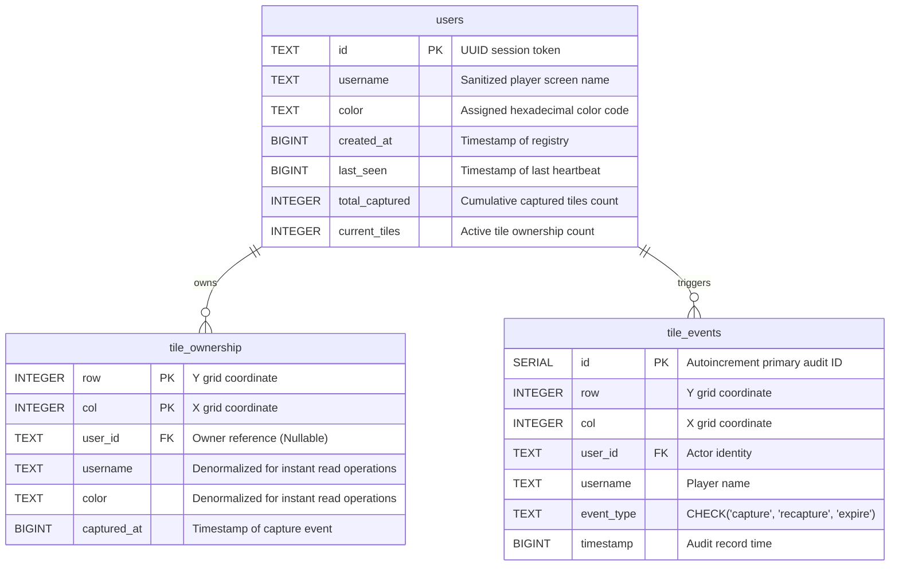

# Database Schema & Persistence Layout

This document details the relational PostgreSQL database schema structures, data types mapping, index designs, and bootstrapping procedures of the ShareGrid application.

---

## 1. Entity-Relationship (ER) Diagram

---

## 2. Table Definitions

### 2.1 `users`
Tracks unique player sessions. Because this is a lightweight game with zero friction, users register session tokens dynamically on handshake.
*   **`id`** (`TEXT`, Primary Key): Randomly generated client UUID.
*   **`username`** (`TEXT`, Not Null): Escaped, sanitized user display name.
*   **`color`** (`TEXT`, Not Null): Assigned color code hex.
*   **`created_at`** (`BIGINT`, Not Null): Epoch millisecond timestamp of user initialization.
*   **`last_seen`** (`BIGINT`, Not Null): Updated during heartbeats. Used by cleanup processes.
*   **`total_captured`** (`INTEGER`, Default `0`): Historical metric for achievements.
*   **`current_tiles`** (`INTEGER`, Default `0`): Currently occupied tile count. Used for leaderboard sort.

### 2.2 `tile_ownership`
Represents the current map snapshot. Used to restore state on server restart.
*   **`row`** (`INTEGER`), **`col`** (`INTEGER`): Composite Primary Keys representing spatial coordinates.
*   **`user_id`** (`TEXT`, Foreign Key): References `users.id` with `ON DELETE SET NULL` mapping.
*   **`username`** (`TEXT`), **`color`** (`TEXT`): Denormalized fields to bypass expensive DB joins during startup loading sequences.
*   **`captured_at`** (`BIGINT`): Millisecond timestamp of active ownership creation.

### 2.3 `tile_events`
Immutable historical event ledger used for analytics and security auditing.
*   **`id`** (`SERIAL`, Primary Key): Autoincrement sequence key.
*   **`row`** (`INTEGER`, Not Null), **`col`** (`INTEGER`, Not Null): Event coordinates.
*   **`user_id`** (`TEXT`, Not Null), **`username`** (`TEXT`, Not Null): Actor identities.
*   **`event_type`** (`TEXT`, Not Null): CHECK constraint restricted to `capture`, `recapture`, or `expire`.
*   **`timestamp`** (`BIGINT`, Not Null): Millisecond epoch timestamp.

---

## 3. Indexing & Optimization Strategy

To support fast queries during heavy live operations, the database leverages targeted indexing:

1.  **`idx_tile_events_user`** on `tile_events(user_id)`: Speeds up historical calculations and audit queries for individual users.
2.  **`idx_tile_events_ts`** on `tile_events(timestamp DESC)`: Optimizes high-frequency queries fetching recent board history feeds (e.g., `LIMIT 50` logs).
3.  **`idx_tile_ownership_uid`** on `tile_ownership(user_id)`: Speeds up cleaning operations when players disconnect.

---

## 4. Automated Schema Bootstrapping
On startup, `postgresDb.js` establishes an connection pool and triggers `bootstrapSchema()`. It encapsulates database creation in an idempotent **SQL transaction block** (`BEGIN ... COMMIT`) to ensure that all tables, foreign keys, and indexes are cleanly created without colliding with existing production tables.
