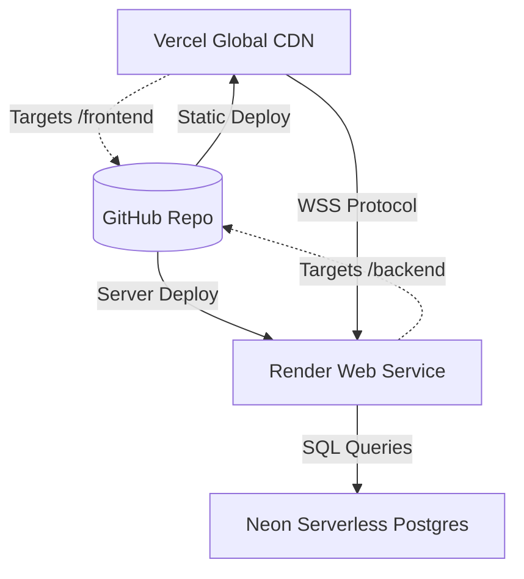

# Technology Stack & Platform Rationale

This document details the architectural justifications for all languages, libraries, databases, and deployment platforms selected for the ShareGrid project.

---

## 1. Technical Rationale Table

| Component | Choice | Justification & Architectural Rationale |
| :--- | :--- | :--- |
| **Frontend Core** | Vanilla HTML5 / Vanilla CSS3 | Eliminates heavy bundlers, transpilation steps, and library loading times. Provides an instant, lightweight user experience. |
| **Frontend Rendering** | Canvas API (2D Context) | Rendering hundreds of grid cells using DOM elements causes severe performance bottlenecks. Direct pixel rendering on Canvas runs at a locked **60 FPS** even with dynamic panning and zooming. |
| **Backend Core** | Node.js (Express) | Single-threaded asynchronous model allows Node to handle thousands of concurrent WebSocket connections efficiently without the CPU context-switching overhead of multi-threaded setups. |
| **Real-time Server** | Native `ws` package | Avoids the heavy protocol wrappers and packet overhead of alternative Socket libraries. Delivers raw TCP execution speeds with a minimal memory footprint. |
| **Database Engine** | Neon DB (PostgreSQL) | Serverless PostgreSQL providing instant scalability. Its high-performance connection pooler enables highly efficient database interactions. |
| **State Caching** | Native `Map` Registry | Bypasses standard database roundtrip latency. The memory cache handles user cooldown validation, active maps, and spatial locks in **under 0.1ms**. |
| **Scaling (Optional)**| Redis (`ioredis`) | Implements a robust Pub/Sub broadcast layer to synchronize game states seamlessly if we scale out to multiple balanced servers. |

---

## 2. Production Deployment Platform Architecture

ShareGrid uses a fully decentralized cloud deployment strategy:

### 2.1 Static Assets (Vercel)
*   **Target Folder:** `/frontend`
*   **Platform Role:** Serves the frontend single-page application (SPA). Vercel acts as a global edge-caching CDN, ensuring static HTML, CSS, and JS files load instantly for players worldwide.

### 2.2 Application Backend (Render)
*   **Target Folder:** `/backend`
*   **Platform Role:** Runs the Node.js WebSocket engine continuously. Render manages SSL termination, provides CPU/RAM monitoring, and enables automatic redeploys on git pushes.

### 2.3 Cloud Persistence (Neon DB)
*   **Platform Role:** Stores the permanent relational PostgreSQL data. Neon’s serverless architecture spins up/down automatically to match traffic, meaning **you pay $0 during zero-traffic windows** while enjoying reliable database persistence.
